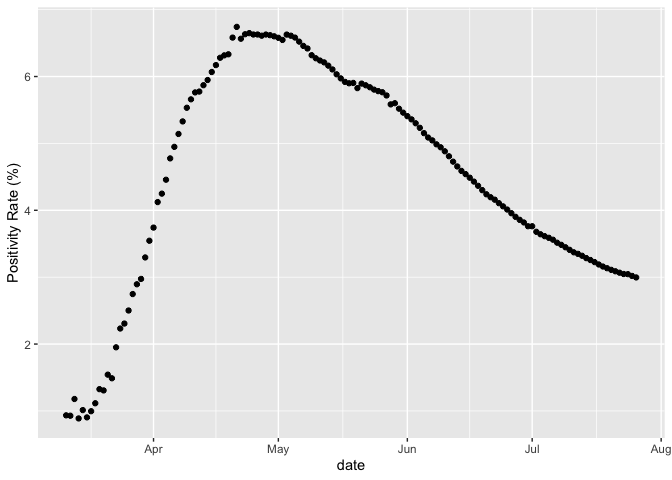
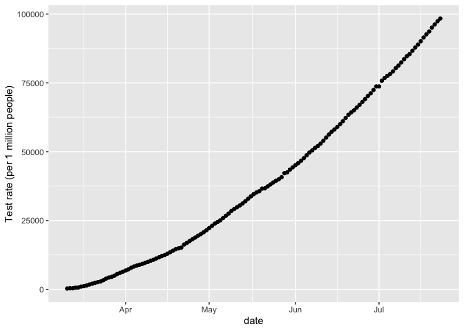

Test Positivity Rate writeup
================
Geetha Jeyapragasan
July 14 2020

## Test Positivity Rates

The test positivity rate (TPR) is the percentage of tests that are
positive.For COVID-19, this metric is being used to evaluate testing
capacity and regime, as well as and severity of an outbreak, (i.e. if
two regions had the same number of cases but one region was conducting
twice the number of tests, it would suggest the region with the higher
positivity rate may be experiencing a more severe outbreak). If the TPR
is too high, it might indicate the region is only testing those who are
extremely sick and seeking medical attention, without sampling the wider
community. A low TPR can indicate sufficient testing capacity. However
due to several factors influencing the test positivity rate, it is not a
direct indicator of testing capacity. The test positivity rate has been
used as a measure of prevalence for outbreaks that occur in regions with
limited or non-existent health surveillance.

### How the TPR is being used and interpreted

AS OF MAY 12, The WHO is currently advising the test positivity rate
should be below 5% for at least 14 days before reopening, suggesting a
TPR between
[3-12%](https://www.who.int/news-room/commentaries/detail/advice-on-the-use-of-point-of-care-immunodiagnostic-tests-for-covid-19)
indicates a region is conducting adequate testing. There is a
significant difference in TPR between countries, with Australia, South
Korea, and Uruguay’s positivity rates below 1%, while Argentina and
Mexico have a 28% and a 66% positivity rate respectively.

The TPR was used to compare the temporal trends and mitigation
strategies of COVID-19 between [Seattle and
Washington](https://jamanetwork.com/journals/jama/fullarticle/2766035).
The paper concluded due to the constant testing volume over the study
period, the TPR trend suggests early and aggressive physical distancing
measures influenced the course of the outbreak. TPR as an good indicator
of robust testing and outbreak control was [criticized in
India](https://thewire.in/health/india-covid-19-testing-contradiction-rate)
due to the extremely low testing volume (India is conducting 9.99 tests
per 1000 people while Australia conducts 136 tests per 1000). Though low
testing rates did not fully account for the low TPR, a low TPR in
regions with low testing rates should be interpreted differently than
regions with a high testing rate. In the state of Virginia, the [antibody test results were combined with the viral PCR tests affecting the TPR](https://www.theatlantic.com/health/archive/2020/05/covid-19-tests-combine-virginia/611620/). With the state using the low TPR to justify the loosening of lockdown restrictions,types of tests included in the metric should be considered when interpreting the value and used for decision making. 

The WHO recommendation for malaria program managers suggest the use of
TPR instead of incidence rates as a measurement if the following 3
factors are inconsistent over time: general outpatient attendance,
testing practices, and reporting completeness. Outpatient attendance may
be affected by transportation accessibility, user fees, political
instability, or general behaviour of treating illnesses at home through
over the counter medication or informal drug distributors. If
private-for-profit or informal health care providers are taken into
account, reporting completeness may be a significant barrier. The TPR is
less sensitive to these factors, through it can still be distorted and
misinterpreted.


``` r
summary(national)
```

    ##                        prname         date               numconf      
    ##  Canada                   :132   Min.   :2020-03-11   Min.   :   103  
    ##  Alberta                  :  0   1st Qu.:2020-04-12   1st Qu.: 25338  
    ##  British Columbia         :  0   Median :2020-05-15   Median : 75228  
    ##  Manitoba                 :  0   Mean   :2020-05-15   Mean   : 63688  
    ##  New Brunswick            :  0   3rd Qu.:2020-06-17   3rd Qu.: 99934  
    ##  Newfoundland and Labrador:  0   Max.   :2020-07-20   Max.   :111113  
    ##  (Other)                  :  0                                        
    ##     numprob         numdeaths         numtotal        numtested      
    ##  Min.   :  0.00   Min.   :   2.0   Min.   :   103   Min.   :  11023  
    ##  1st Qu.: 11.00   1st Qu.: 764.2   1st Qu.: 25356   1st Qu.: 433656  
    ##  Median : 11.00   Median :5620.5   Median : 75238   Median :1253500  
    ##  Mean   : 22.41   Mean   :4768.1   Mean   : 63710   Mean   :1406338  
    ##  3rd Qu.: 11.25   3rd Qu.:8265.5   3rd Qu.: 99945   3rd Qu.:2264721  
    ##  Max.   :833.00   Max.   :8858.0   Max.   :111124   Max.   :3573630  
    ##                                                                      
    ##    numrecover    percentrecover       ratetested       numtoday     
    ##  Min.   :  230   Length:132         Min.   :  293   Min.   :   0.0  
    ##  1st Qu.:25740   Class :character   1st Qu.:11536   1st Qu.: 355.2  
    ##  Median :47824   Mode  :character   Median :33348   Median : 746.5  
    ##  Mean   :44957                      Mean   :37413   Mean   : 841.3  
    ##  3rd Qu.:65174                      3rd Qu.:60249   3rd Qu.:1257.5  
    ##  Max.   :97474                      Max.   :95071   Max.   :2760.0  
    ##  NA's   :28                                                         
    ##   percentoday        ratetotal        ratedeaths      deathstoday    
    ##  Min.   : 0.0000   Min.   :  0.27   Min.   : 0.005   Min.   :  0.00  
    ##  1st Qu.: 0.4175   1st Qu.: 67.46   1st Qu.: 2.033   1st Qu.: 10.75  
    ##  Median : 1.5550   Median :200.16   Median :14.953   Median : 50.00  
    ##  Mean   : 6.0755   Mean   :169.49   Mean   :12.685   Mean   : 67.09  
    ##  3rd Qu.: 5.9000   3rd Qu.:265.88   3rd Qu.:21.989   3rd Qu.:116.00  
    ##  Max.   :46.2300   Max.   :295.63   Max.   :23.565   Max.   :222.00  
    ##                                                                      
    ##   percentdeath    testedtoday    recoveredtoday    percentactive  
    ##  Min.   :0.790   Min.   :    0   Min.   :    0.0   Min.   : 3.78  
    ##  1st Qu.:3.015   1st Qu.:16681   1st Qu.:  368.8   1st Qu.:29.56  
    ##  Median :7.460   Median :27068   Median :  689.5   Median :42.88  
    ##  Mean   :5.836   Mean   :27073   Mean   :  991.1   Mean   :53.80  
    ##  3rd Qu.:8.170   3rd Qu.:36788   3rd Qu.:  919.5   3rd Qu.:84.27  
    ##  Max.   :8.330   Max.   :78091   Max.   :23853.0   Max.   :99.21  
    ##                                  NA's   :28                       
    ##       tpr       
    ##  Min.   :0.888  
    ##  1st Qu.:3.507  
    ##  Median :4.845  
    ##  Mean   :4.590  
    ##  3rd Qu.:5.927  
    ##  Max.   :6.742  
    ## 

### Canada Test Positivity Rate

<!-- -->

### Canada Testing Rates

<!-- -->
