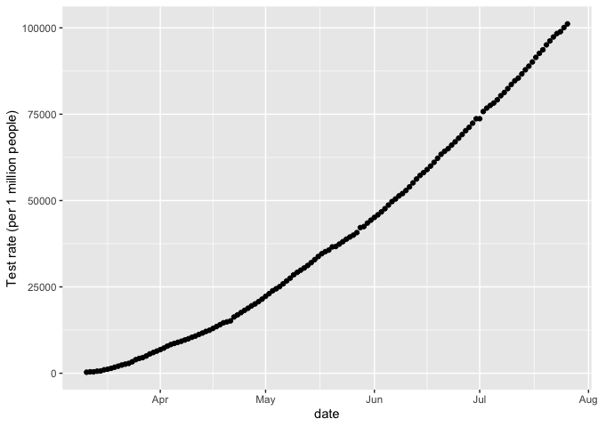
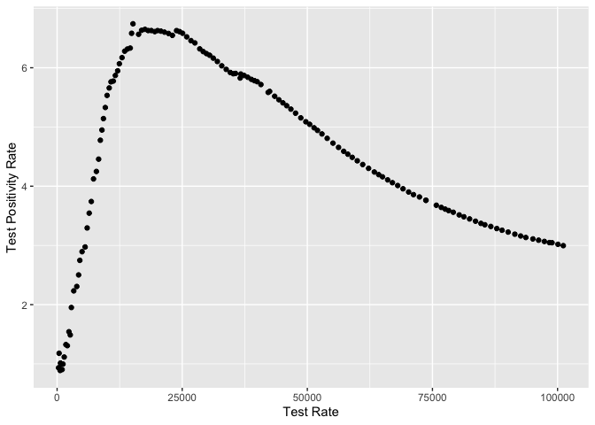

Test Positivity Rate Writeup
================
Geetha Jeyapragasan
July 14 2020

The test positivity rate (TPR) is the percentage of tests that are
positive.For COVID-19, this metric is being used to evaluate testing
capacity and regime, as well as and severity of an outbreak, (i.e. if
two regions had the same number of cases but one region was conducting
twice the number of tests, it would suggest the region with the higher
positivity rate may be experiencing a more severe outbreak). If the TPR
is too high, it might indicate the region is only testing those who are
extremely sick and seeking medical attention, without sampling the wider
community. A low TPR can indicate sufficient testing capacity. However
due to several factors influencing the test positivity rate, it is not a
direct indicator of testing capacity. The test positivity rate has been
used as a measure of prevalence for outbreaks that occur in regions with
limited or non-existent health surveillance.

### Factors that Affect the TPR

1.  Type of tests included in metric. Some regions are not transparent
    in the technologies used for COVID-19 tests, or aggregate PCR and
    antibody tests making the data less meaningful.
2.  Whether the numbers are \# of performed tests or \# of individuals
    tested.
3.  Whether negative results are included, and how pending results or
    inconclusive results are reported.
4.  Are tests from private labs included? Not all labs report to the
    central authority, or are specifically not included in the testing
    data (i.e. US CDC)
5.  Testing eligibility criteria
6.  Whether the time period of cumulative counts if daily counts are not
    being reported.

### How the TPR is being used and interpreted

  - As of May 12, The WHO is currently advising reopening measures based
    on the TPR. The test positivity rate should be below 5% for at least
    14 days before reopening, suggesting a TPR between
    [3-12%](https://www.who.int/news-room/commentaries/detail/advice-on-the-use-of-point-of-care-immunodiagnostic-tests-for-covid-19)
    indicates a region is conducting adequate testing.
  - The [CDC opening up
    plan](https://www.cdc.gov/coronavirus/2019-ncov/downloads/php/CDC-Activities-Initiatives-for-COVID-19-Response.pdf)
    uses the TPR to assess testing program robustness. The criteria
    proposes a \<20% TPR to enter Phase 1, \<15% to enter Phase 2 and
    \<10% to enter Phase 3 (maintaining these values for at least 14
    days). \*\* Multi-day increases in TPR with stable or increasing
    testing suggest potential a potential rebound that should be
    investigated.
  - The TPR was used to compare the temporal trends and mitigation
    strategies of COVID-19 between [Seattle and
    Washington](https://jamanetwork.com/journals/jama/fullarticle/2766035)
    . The paper concluded due to the constant testing volume over the
    study period, the TPR trend suggests early and aggressive physical
    distancing measures influenced the course of the outbreak.
  - TPR as an good indicator of robust testing and outbreak control was
    [criticized in
    India](https://thewire.in/health/india-covid-19-testing-contradiction-rate)
    due to the extremely low testing volume (India is conducting 9.99
    tests per 1000 people while Australia conducts 136 tests per 1000).
    Though low testing rates did not fully account for the low TPR, a
    low TPR in regions with low testing rates should be interpreted
    differently than regions with a high testing rate.
  - The [CDC’s initial
    mixup](https://www.theatlantic.com/health/archive/2020/05/cdc-and-states-are-misreporting-covid-19-test-data-pennsylvania-georgia-texas/611935/)
    of viral and antibody tests reported together caused positivity
    rates to appear low. Several states such as Pennsylvania, Texas,
    Georgia, Vermont, and Virginia have used the aggregated TPR to guide
    reopening. In the state of Virginia, the antibody test results were
    combined with the viral PCR tests affecting the TPR. With the state
    using the low TPR to justify the loosening of lockdown
    restrictions,types of tests included in the metric should be
    considered when interpreting the value and used for decision making.
    Virginia has since separated the tests following this article.

The WHO recommendation for malaria program managers suggest the use of
TPR instead of incidence rates as a measurement if the following 3
factors are inconsistent over time: general outpatient attendance,
testing practices, and reporting completeness. Outpatient attendance may
be affected by transportation accessibility, user fees, political
instability, or general behaviour of treating illnesses at home through
over the counter medication or informal drug distributors. If
private-for-profit or informal health care providers are taken into
account, reporting completeness may be a significant barrier. The TPR is
less sensitive to these factors, through it can still be distorted and
misinterpreted.

``` r
summary(national)
```

    ##                        prname         date               numconf      
    ##  Canada                   :138   Min.   :2020-03-11   Min.   :   103  
    ##  Alberta                  :  0   1st Qu.:2020-04-14   1st Qu.: 27376  
    ##  British Columbia         :  0   Median :2020-05-18   Median : 78581  
    ##  Manitoba                 :  0   Mean   :2020-05-18   Mean   : 65826  
    ##  New Brunswick            :  0   3rd Qu.:2020-06-21   3rd Qu.:101551  
    ##  Newfoundland and Labrador:  0   Max.   :2020-07-26   Max.   :113898  
    ##  (Other)                  :  0                                        
    ##     numprob      numdeaths         numtotal        numtested      
    ##  Min.   :  0   Min.   :   2.0   Min.   :   103   Min.   :  11023  
    ##  1st Qu.: 11   1st Qu.: 929.8   1st Qu.: 27392   1st Qu.: 458171  
    ##  Median : 11   Median :5877.0   Median : 78592   Median :1331709  
    ##  Mean   : 22   Mean   :4946.7   Mean   : 65848   Mean   :1506463  
    ##  3rd Qu.: 13   3rd Qu.:8434.5   3rd Qu.:101562   3rd Qu.:2436949  
    ##  Max.   :833   Max.   :8890.0   Max.   :113911   Max.   :3801950  
    ##                                                                   
    ##    numrecover    percentrecover       ratetested        numtoday     
    ##  Min.   :  230   Length:138         Min.   :   293   Min.   :   0.0  
    ##  1st Qu.:27288   Class :character   1st Qu.: 12189   1st Qu.: 356.2  
    ##  Median :50048   Mode  :character   Median : 35428   Median : 703.0  
    ##  Mean   :47884                      Mean   : 40077   Mean   : 824.9  
    ##  3rd Qu.:66931                      3rd Qu.: 64831   3rd Qu.:1245.8  
    ##  Max.   :99355                      Max.   :101145   Max.   :2760.0  
    ##  NA's   :28                                                          
    ##   percentoday        ratetotal        ratedeaths      deathstoday    
    ##  Min.   : 0.0000   Min.   :  0.27   Min.   : 0.010   Min.   :  0.00  
    ##  1st Qu.: 0.4025   1st Qu.: 72.88   1st Qu.: 2.473   1st Qu.:  9.00  
    ##  Median : 1.4600   Median :209.08   Median :15.635   Median : 46.00  
    ##  Mean   : 5.8293   Mean   :175.18   Mean   :13.160   Mean   : 64.41  
    ##  3rd Qu.: 5.3725   3rd Qu.:270.19   3rd Qu.:22.438   3rd Qu.:112.75  
    ##  Max.   :46.2300   Max.   :303.04   Max.   :23.650   Max.   :222.00  
    ##                                                                      
    ##   percentdeath    testedtoday    recoveredtoday    percentactive  
    ##  Min.   :0.790   Min.   :    0   Min.   :    0.0   Min.   : 3.78  
    ##  1st Qu.:3.395   1st Qu.:16830   1st Qu.:  356.5   1st Qu.:28.46  
    ##  Median :7.500   Median :27622   Median :  678.0   Median :42.08  
    ##  Mean   :5.924   Mean   :27550   Mean   :  954.1   Mean   :51.67  
    ##  3rd Qu.:8.168   3rd Qu.:37772   3rd Qu.:  897.5   3rd Qu.:83.03  
    ##  Max.   :8.330   Max.   :78091   Max.   :23853.0   Max.   :99.21  
    ##                                  NA's   :28                       
    ##    numactive       rateactive    numtotal_last14 ratetotal_last14
    ##  Min.   :  101   Min.   : 0.27   Min.   : 2715   Min.   : 7.22   
    ##  1st Qu.:12770   1st Qu.:33.97   1st Qu.: 5226   1st Qu.:13.90   
    ##  Median :27702   Median :73.69   Median :11855   Median :31.54   
    ##  Mean   :22732   Mean   :60.48   Mean   :12352   Mean   :32.86   
    ##  3rd Qu.:31572   3rd Qu.:83.99   3rd Qu.:18768   3rd Qu.:49.93   
    ##  Max.   :35001   Max.   :93.11   Max.   :24688   Max.   :65.68   
    ##                                  NA's   :13      NA's   :13      
    ##  numdeaths_last14 ratedeaths_last14      tpr       
    ##  Min.   :  25.0   Min.   :0.070     Min.   :0.888  
    ##  1st Qu.: 257.0   1st Qu.:0.680     1st Qu.:3.355  
    ##  Median : 818.0   Median :2.180     Median :4.691  
    ##  Mean   : 990.1   Mean   :2.634     Mean   :4.523  
    ##  3rd Qu.:1553.0   3rd Qu.:4.130     3rd Qu.:5.903  
    ##  Max.   :2311.0   Max.   :6.150     Max.   :6.742  
    ##  NA's   :13       NA's   :13

### Canada Test Positivity Rate

<!-- -->

### Canada Testing Rates

<!-- -->

### Cumulative Testing Rate against TPR

<!-- -->
