Data Visualization
================
Geetha
23/08/2020

## Overview of Global Performance

South Korea, Vietnam, Germany and New Zealand have been highlighted by
[Exemplars in Global
Health](https://www.exemplars.health/emerging-topics/epidemic-preparedness-and-response/covid-19)
as countries that are doing comparatively well in managing their
outbreak. Mexico, India, Indonesia, and Argentina are examples of
countries that have not yet “bent the curve”, many with quite high test
positivity rates.

#### Metrics

  - Test positivity rate: daily TPR, cumulative TPR
  - Number of Deaths (daily, cumulative, per million, per thousand,
    smoothed over 7 days)
  - Number of cases (daily, cumulative per million, per thousand,
    smoothed over 7 days)
  - Number of tests (raw,per million, per thousand, smoothed over 7
    days)

Potential Independent variables:

  - Non-pharmaceutical interventions: closings, masks, lockdown, debt
    relief, etc.
  - GHS index: overall score, category scores, sub-indicator scores
  - Country characteristics: population, pop density, median age, % pop
    \> 65 y/0, % pop \> 70 y/o, GDP
  - Disease burden: cardiovascular disease, diabetes, smoking, life
    expectancy
  - Weather: temp, wind, humidity, precipitation

Potential Options for Inclusion/Exclusion Criteria:

  - remove countries with \> 100 number of confirmed cases (some papers
    have used 1000)
  - remove countries with population \>1,000,000
  - only use OECD countries (this is what is currently used for the
    graphs below)
  - only WHO member states
  - completeness of dataset (must have test data for X% of sample
    period)

Below, independent variables that were not time dependent (health
indices)

# Metrics Over Time

### Testing

#### Number of Tests

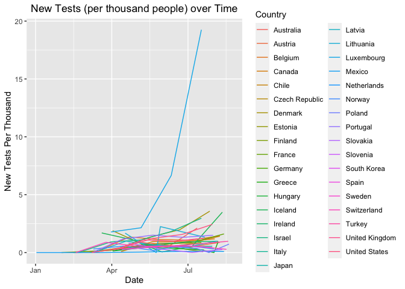<!-- -->

#### Test Positivity Rates Over Time

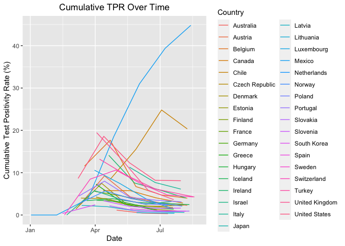<!-- -->

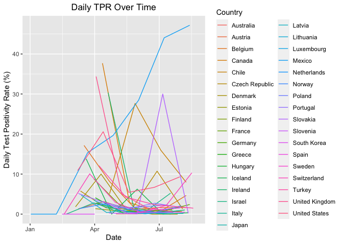<!-- -->

#### Number of Cases

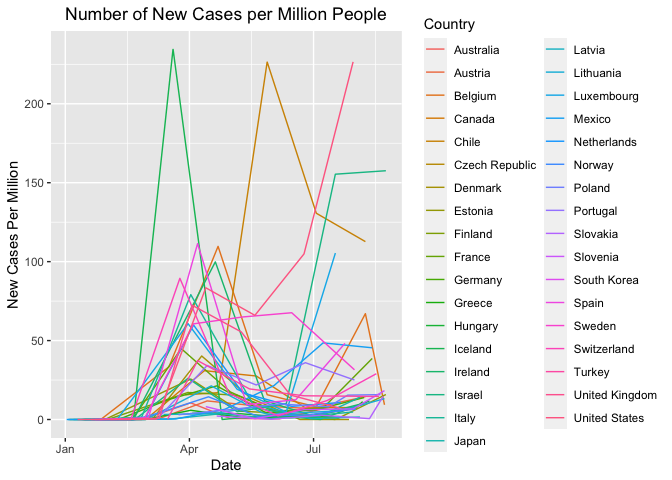<!-- -->

#### Number of Deaths

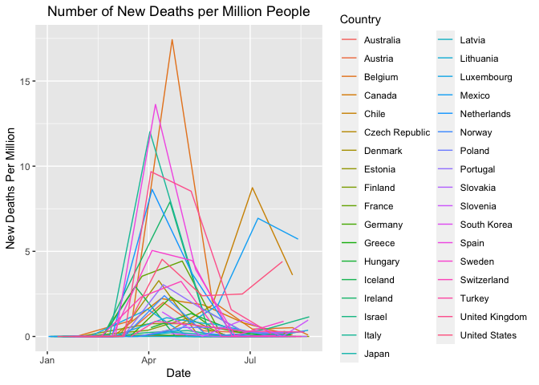<!-- -->

## Non Pharmaceutical Interventions

##### Overal Government Stringency Score

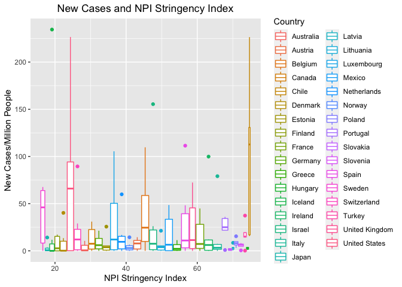<!-- -->

### Interventions within Stringency Index

<!-- -->

### Mask Policy

Intensity of mask policy within region.

1 - General recommendation

2 - Mandatory in specific regions of country or specific places (public
transport, inside shops)

3 - Mandatory everywhere or universal usage

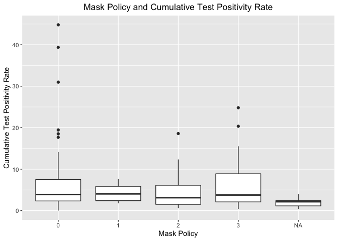<!-- -->

## Disease Burden

Evaluating the effects of prevalence of diabetes (% of population),
smoking (% of group), and cardiovascular deaths (per 1000 people) on the
cumulative test positivity rate.
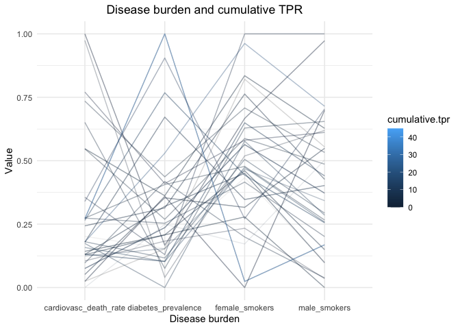<!-- -->

## Mobility Measures

Mobility Trends in % change relative to baseline, from Google Mobility
Reports. 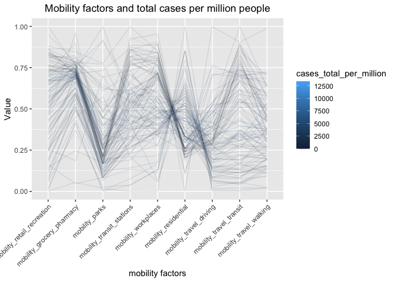<!-- -->

## Global Health Security Index

<!-- -->

### GHSI Categories

<!-- -->

### Healthcare Access

Assessing relationship between healthcare access (measured by ghs
indices) and deaths
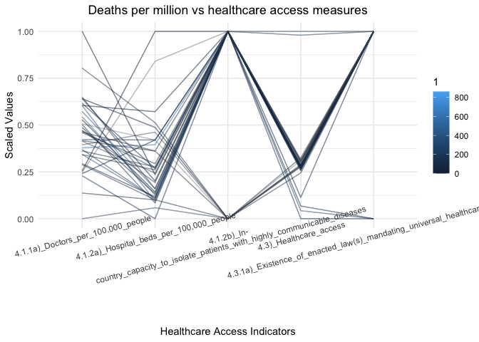<!-- -->

## Weather Variables

#### Humidity

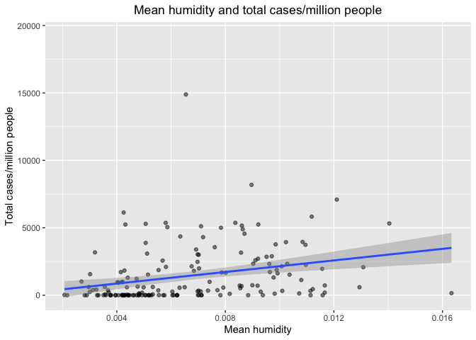<!-- -->

#### Temperature Speed

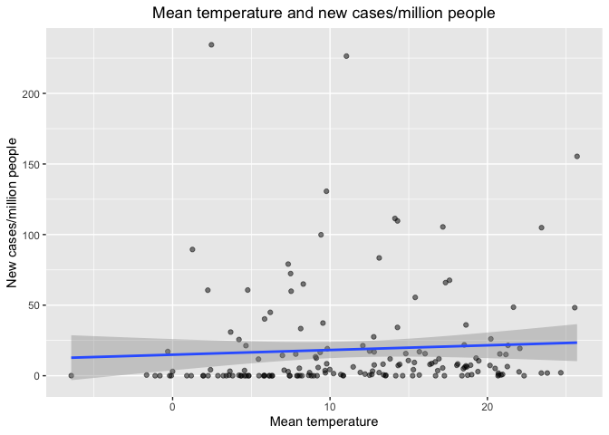<!-- -->

#### Wind Speed

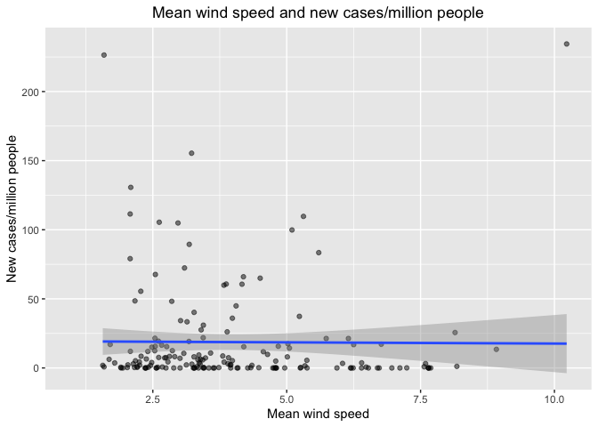<!-- -->
