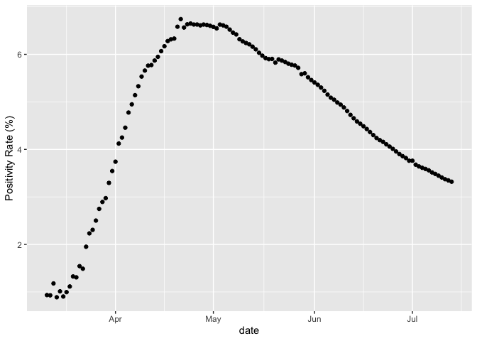
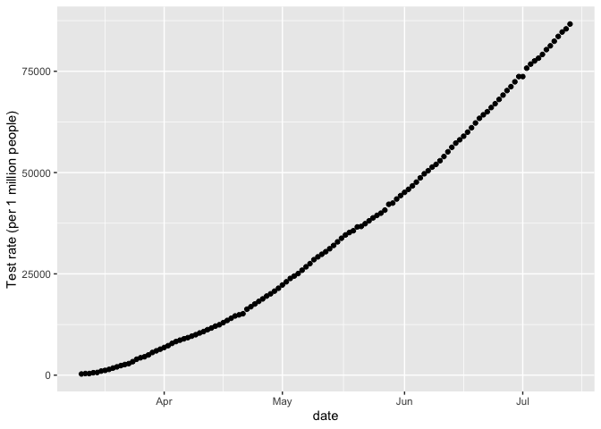

Markdown Practice
================
Geetha Jeyapragasan
July 14 2020

## Test Positivity Rates

The test positivity rate (TPR) is the percentage of tests that are
positive. If the positivity rate is too high, it can indicate the region
is only testing those who are extremely sick and seeking medical
attention, without sampling the wider community. A low test positivity
rate can indicate sufficient testing capacity. The WHO has suggested it
is safe for regions to reopen if the positivity rate remains ≥ 5% for at
least 14 days <https://coronavirus.jhu.edu/testing/testing-positivity>.
These measurements focus on real time PCR tests, and do not include
serology or antibody tests.

``` r
summary(national)
```

    ##                        prname         date               numconf      
    ##  Canada                   :125   Min.   :2020-03-11   Min.   :   103  
    ##  Alberta                  :  0   1st Qu.:2020-04-11   1st Qu.: 23301  
    ##  British Columbia         :  0   Median :2020-05-12   Median : 71146  
    ##  Manitoba                 :  0   Mean   :2020-05-12   Mean   : 61113  
    ##  New Brunswick            :  0   3rd Qu.:2020-06-12   3rd Qu.: 97932  
    ##  Newfoundland and Labrador:  0   Max.   :2020-07-13   Max.   :108144  
    ##  (Other)                  :  0                                        
    ##     numprob         numdeaths       numtotal        numtested      
    ##  Min.   :  0.00   Min.   :   2   Min.   :   103   Min.   :  11023  
    ##  1st Qu.: 11.00   1st Qu.: 653   1st Qu.: 23318   1st Qu.: 404651  
    ##  Median : 11.00   Median :5169   Median : 71157   Median :1145568  
    ##  Mean   : 23.05   Mean   :4540   Mean   : 61136   Mean   :1292724  
    ##  3rd Qu.: 12.00   3rd Qu.:8049   3rd Qu.: 97943   3rd Qu.:2072096  
    ##  Max.   :833.00   Max.   :8790   Max.   :108155   Max.   :3257608  
    ##                                                                    
    ##    numrecover    percentrecover       ratetested       numtoday     
    ##  Min.   :  230   Length:125         Min.   :  293   Min.   :   0.0  
    ##  1st Qu.:23801   Class :character   1st Qu.:10765   1st Qu.: 367.0  
    ##  Median :45352   Mode  :character   Median :30476   Median : 772.0  
    ##  Mean   :41958                      Mean   :34391   Mean   : 864.6  
    ##  3rd Qu.:63003                      3rd Qu.:55125   3rd Qu.:1274.0  
    ##  Max.   :71841                      Max.   :86663   Max.   :2760.0  
    ##  NA's   :28                                                         
    ##   percentoday       ratetotal        ratedeaths      deathstoday   
    ##  Min.   : 0.000   Min.   :  0.27   Min.   : 0.005   Min.   :  0.0  
    ##  1st Qu.: 0.490   1st Qu.: 62.03   1st Qu.: 1.737   1st Qu.: 13.0  
    ##  Median : 1.680   Median :189.30   Median :13.751   Median : 57.0  
    ##  Mean   : 6.394   Mean   :162.64   Mean   :12.079   Mean   : 70.3  
    ##  3rd Qu.: 6.030   3rd Qu.:260.56   3rd Qu.:21.413   3rd Qu.:117.0  
    ##  Max.   :46.230   Max.   :287.73   Max.   :23.384   Max.   :222.0  
    ##                                                                    
    ##   percentdeath    testedtoday    recoveredtoday    percentactive  
    ##  Min.   :0.790   Min.   :    0   Min.   :    0.0   Min.   :25.41  
    ##  1st Qu.:2.800   1st Qu.:16073   1st Qu.:  398.0   1st Qu.:32.03  
    ##  Median :7.260   Median :26065   Median :  701.0   Median :44.90  
    ##  Mean   :5.712   Mean   :26061   Mean   :  798.4   Mean   :56.08  
    ##  3rd Qu.:8.180   3rd Qu.:35155   3rd Qu.:  924.0   3rd Qu.:89.66  
    ##  Max.   :8.330   Max.   :78091   Max.   :11178.0   Max.   :99.21  
    ##                                  NA's   :28                       
    ##       tpr       
    ##  Min.   :0.888  
    ##  1st Qu.:3.642  
    ##  Median :4.986  
    ##  Mean   :4.669  
    ##  3rd Qu.:5.972  
    ##  Max.   :6.742  
    ## 

### Canada Test Positivity Rate

<!-- -->

### Canada Testing Rates

<!-- -->
